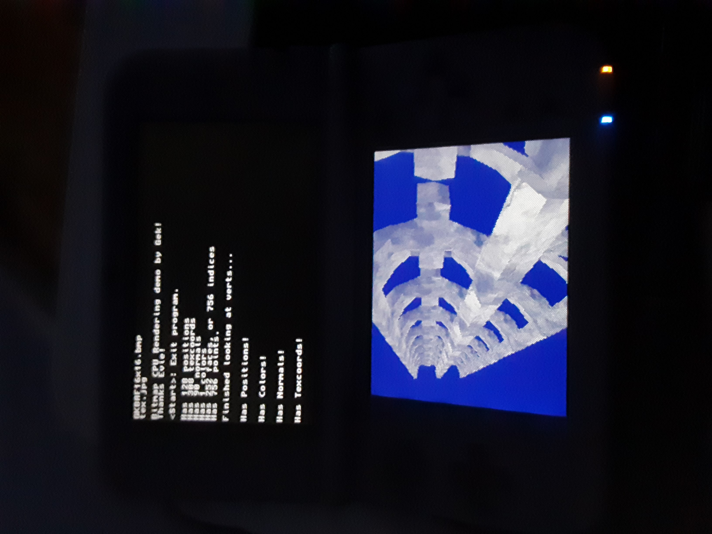

# TinyGL for the Nintendo 3DS

Written by Gek, Jan 2021.
TinyGL originally written by Fabrice Bellard, under the MIT License.

This Repository available to you under the MiT License, except for Strongest.mp3, which is Copyright
(demogroup) St Vincent and the Grenadines

Depends: Devkitpro, Libctru, ImageMagick

This program demonstrates how to use LibCtru and TinyGL to draw graphics alongside SDL driving audio.

Note that because the nintendo 3DS uses vertical rasters, X and Y coordinates are swapped in TinyGL.

